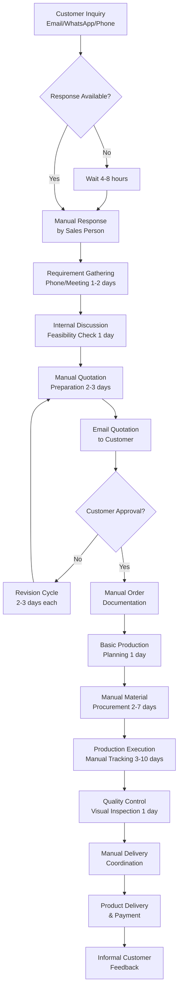
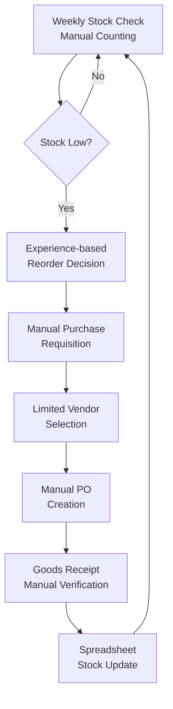
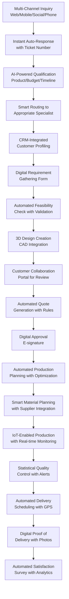
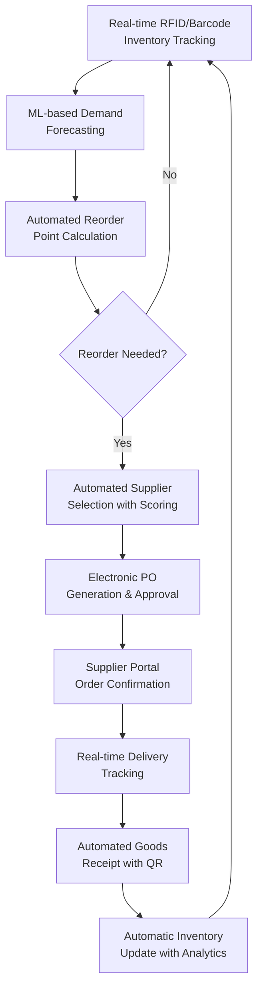
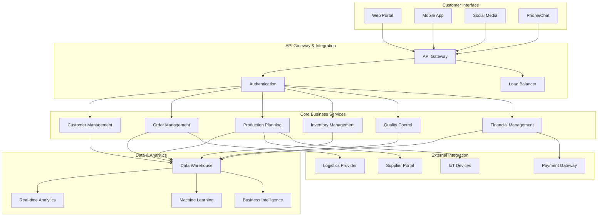
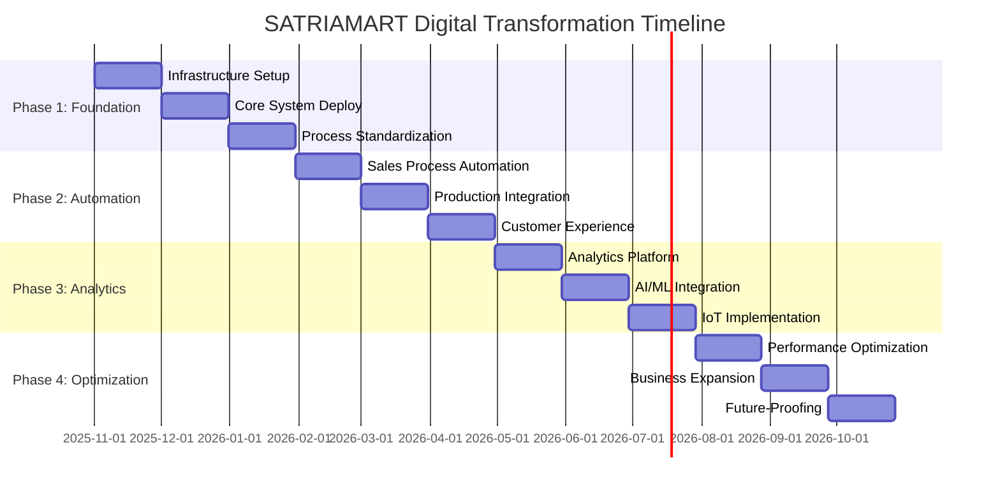
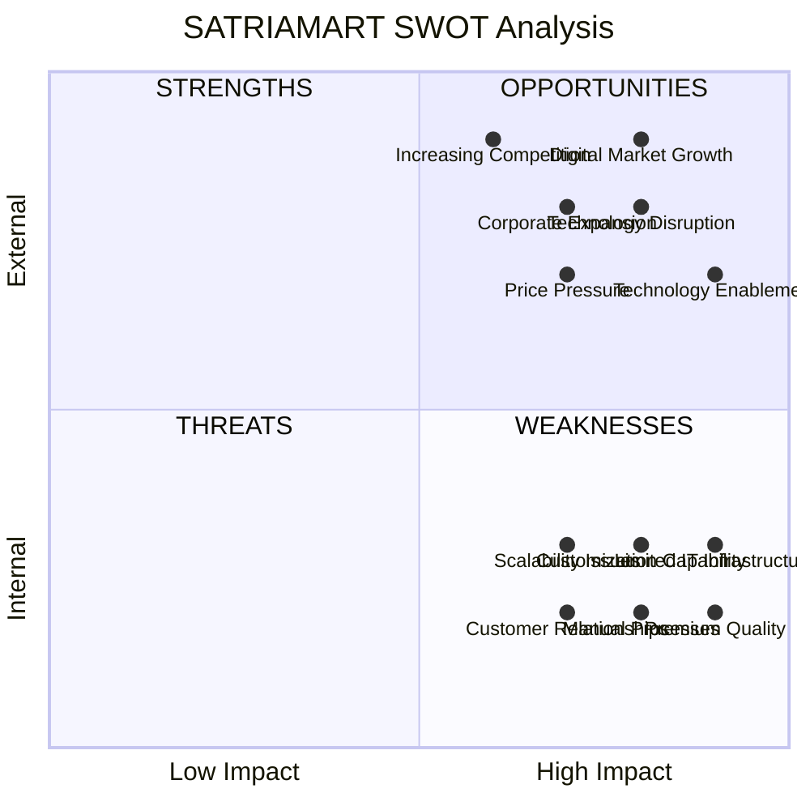
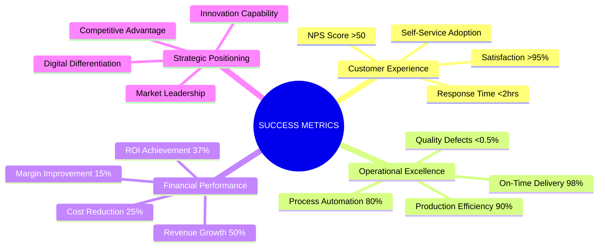

# VISUALISASI PROSES BISNIS SATRIAMART
## Current State vs Future State Process Flow

### CURRENT STATE (AS-IS) PROCESS FLOW

#### 1. CUSTOMER-TO-CASH PROCESS (CURRENT)

**BOTTLENECKS & ISSUES:**
- ⚠️ **4-8 hour response delay**
- ⚠️ **Multiple revision cycles**
- ⚠️ **Manual documentation prone to errors**
- ⚠️ **No real-time tracking**
- ⚠️ **Limited customer visibility**

---

#### 2. INVENTORY MANAGEMENT PROCESS (CURRENT)

**ISSUES:**
- ⚠️ **Reactive reordering**
- ⚠️ **No real-time visibility**
- ⚠️ **Manual reconciliation errors**
- ⚠️ **Limited supplier options**

---

### FUTURE STATE (TO-BE) PROCESS FLOW

#### 1. DIGITAL CUSTOMER ENGAGEMENT PROCESS

**IMPROVEMENTS:**
- ✅ **Instant response time**
- ✅ **Automated workflows**
- ✅ **Real-time tracking**
- ✅ **Customer self-service**
- ✅ **Data-driven decisions**

---

#### 2. SMART INVENTORY MANAGEMENT PROCESS

**IMPROVEMENTS:**
- ✅ **Predictive reordering**
- ✅ **Real-time visibility**
- ✅ **Automated processes**
- ✅ **Supplier diversity**
- ✅ **Data analytics**

---

### PROCESS COMPARISON MATRIX

| **Aspect** | **Current State** | **Future State** | **Improvement** |
|------------|-------------------|------------------|-----------------|
| **Response Time** | 4-8 hours | <5 minutes | **95% faster** |
| **Quote Generation** | 2-3 days | 2-4 hours | **80% faster** |
| **Order Processing** | Manual, error-prone | Automated, validated | **90% accuracy** |
| **Production Tracking** | Manual, limited | Real-time, comprehensive | **100% visibility** |
| **Quality Control** | Reactive, manual | Predictive, automated | **90% defect reduction** |
| **Customer Visibility** | Limited, ad-hoc | Real-time, self-service | **Complete transparency** |
| **Inventory Management** | Reactive, manual | Predictive, automated | **30% cost reduction** |
| **Data Analytics** | None | Comprehensive | **Data-driven decisions** |

---

### TECHNOLOGY INTEGRATION ARCHITECTURE

---

### IMPLEMENTATION PHASES VISUALIZATION

---

### KEY PERFORMANCE INDICATORS DASHBOARD

#### Current vs Target Metrics

| **KPI Category** | **Current** | **Target** | **Timeline** |
|------------------|-------------|------------|--------------|
| **📞 Response Time** | 4-8 hours | <2 hours | 3 months |
| **💰 Conversion Rate** | 18% | 35% | 6 months |
| **😊 Customer Satisfaction** | 75% | 95% | 6 months |
| **⏱️ Order Fulfillment** | 7-14 days | 5-8 days | 9 months |
| **🏭 Production Efficiency** | 68% | 90% | 9 months |
| **♻️ Material Waste** | 8% | <3% | 6 months |
| **📦 On-Time Delivery** | 82% | 98% | 6 months |
| **🔍 Quality Defects** | 3.2% | <0.5% | 12 months |

---

### SWOT ANALYSIS VISUALIZATION

---

### RISK ASSESSMENT MATRIX

| **Risk** | **Probability** | **Impact** | **Risk Level** | **Mitigation Strategy** |
|----------|----------------|------------|----------------|-------------------------|
| **User Adoption Resistance** | Medium | High | 🔴 High | Comprehensive training & change management |
| **System Integration Failure** | Low | High | 🟡 Medium | Proof of concept & phased approach |
| **Budget Overrun** | Medium | Medium | 🟡 Medium | Detailed planning & monitoring |
| **Data Migration Issues** | Medium | High | 🔴 High | Comprehensive audit & backup strategy |
| **Performance Problems** | Low | Medium | 🟢 Low | Load testing & monitoring |
| **Security Vulnerabilities** | Low | High | 🟡 Medium | Security audits & best practices |

---

### SUCCESS MEASUREMENT FRAMEWORK

---

### IMPLEMENTATION ROADMAP SUMMARY

#### 🚀 **PHASE 1: Foundation (Month 1-3)**
- Infrastructure setup & basic integration
- Core system implementation
- Process standardization & user training

#### ⚡ **PHASE 2: Automation (Month 4-6)**
- Sales process automation
- Production integration
- Customer experience enhancement

#### 🤖 **PHASE 3: Intelligence (Month 7-9)**
- Analytics platform implementation
- AI/ML integration
- IoT deployment

#### 🎯 **PHASE 4: Optimization (Month 10-12)**
- Performance optimization
- Business expansion support
- Future-proofing initiatives

---

**CONCLUSION:** 
This process transformation will position SATRIAMART as the **digital leader** in the Indonesian acrylic industry, delivering superior customer experience while achieving operational excellence and sustainable competitive advantage.
