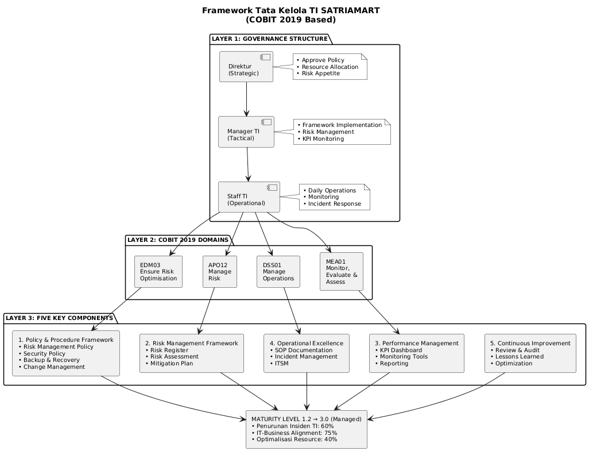
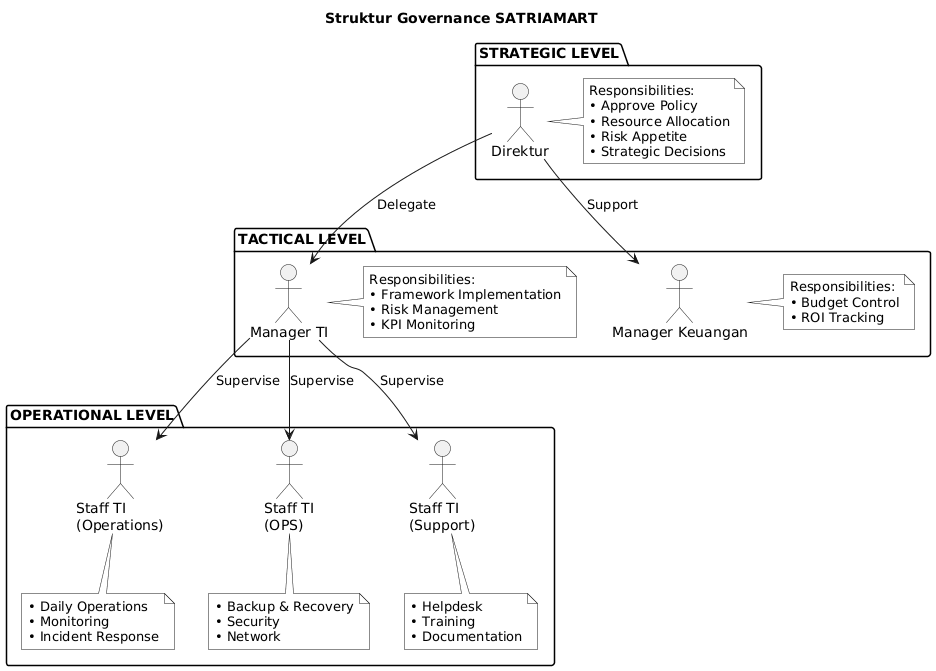
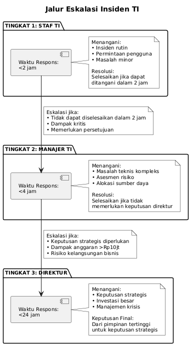

Vol. XX, No. X Desember 2025 | DOI: 10.33480/pilar.vXX.xxxx

# ASESMEN DAN IMPLEMENTASI TATA KELOLA TI PADA SATRIAMART MENGGUNAKAN COBIT 2019

**Roki Anjas¹*; Fahruroji²; Susanto³**

Program Studi Sistem Informasi¹·²·³  
Universitas Nusa Mandiri, Jakarta, Indonesia¹·²·³  
https://www.nusamandiri.ac.id¹·²·³  
11250066@nusamandiri.ac.id¹*; 11250085@nusamandiri.ac.id²; 11250068@nusamandiri.ac.id³  
(*) Corresponding Author

Karya ini didistribusikan di bawah Lisensi Creative Commons Attribution-NonCommercial 4.0 International.

---

## Abstract

*The rapid development of information technology demands organizations to implement structured IT governance to optimize business value and manage risks effectively. SATRIAMART, a retail company specializing in acrylic decorations and accessories, faces challenges in managing information technology with a maturity level of only 1.2 on a scale of 5 (ad-hoc/initial). This research aims to assess the current maturity level of IT governance and design a comprehensive implementation roadmap using the COBIT 2019 framework. The research methodology combines maturity assessment, gap analysis, and risk-based control testing on four domains: EDM03, APO12, DSS01, and MEA01. Data was collected through documentation analysis, interviews, and observations conducted from May to October 2025. The results show that the current maturity level is 1.2 with critical gaps in risk management, resource optimization, and IT-business alignment. The proposed framework and 18-24 month implementation roadmap aims to increase the maturity level to 3.0 (managed), reduce IT incidents by 60%, improve IT-business alignment by 75%, and optimize IT resource utilization by 40%. This research contributes to the literature on COBIT 2019 implementation in medium-scale retail companies in Indonesia and provides a practical model that can be adapted by similar organizations.*

**Keywords:** cobit 2019, gap analysis, it governance, maturity assessment, risk management.

---

## Abstrak

Perkembangan teknologi informasi yang pesat menuntut organisasi untuk menerapkan tata kelola TI yang terstruktur guna mengoptimalkan nilai bisnis dan mengelola risiko secara efektif. SATRIAMART, perusahaan ritel yang bergerak di bidang dekorasi dan aksesoris akrilik, menghadapi tantangan dalam mengelola teknologi informasi dengan tingkat kematangan hanya 1,2 dari skala 5 (tidak formal/*ad-hoc*). Penelitian ini bertujuan untuk melakukan asesmen tingkat kematangan tata kelola TI saat ini dan merancang peta jalan implementasi yang komprehensif menggunakan kerangka kerja COBIT 2019. Metodologi penelitian mengombinasikan asesmen kematangan, analisis kesenjangan, dan pengujian kontrol berbasis risiko pada empat domain: EDM03, APO12, DSS01, dan MEA01. Data dikumpulkan melalui analisis dokumentasi, wawancara, dan observasi yang dilakukan pada periode Mei–Oktober 2025. Hasil penelitian menunjukkan bahwa tingkat kematangan saat ini berada pada level 1,2 dengan kesenjangan kritis dalam manajemen risiko, optimalisasi sumber daya, dan keselarasan TI-bisnis. Kerangka kerja yang dirancang dan peta jalan implementasi selama 18–24 bulan bertujuan untuk meningkatkan tingkat kematangan menjadi 3,0 (terkelola/*managed*), mengurangi insiden TI sebesar 60%, meningkatkan keselarasan TI-bisnis sebesar 75%, dan mengoptimalkan utilisasi sumber daya TI sebesar 40%. Penelitian ini berkontribusi pada literatur implementasi COBIT 2019 di perusahaan ritel skala menengah di Indonesia dan memberikan model praktis yang dapat diadaptasi oleh organisasi sejenis.

**Kata Kunci:** analisis kesenjangan, asesmen kematangan, cobit 2019, manajemen risiko, tata kelola ti.

---

## PENDAHULUAN

Di era transformasi digital, tata kelola TI yang efektif dapat meningkatkan nilai bisnis hingga 20% melalui pengelolaan risiko dan pemanfaatan sumber daya yang optimal (IT Governance Institute, 2021). Penelitian menunjukkan bahwa 100% studi tata kelola TI pada perusahaan manufaktur Indonesia menggunakan kerangka kerja COBIT, dengan 62% mengadopsi COBIT 2019 karena fleksibilitas dan adaptabilitasnya (Aziz, Kusrini, & Nasiri, 2023; Thehawijaya & Fajar, 2024; ISACA, 2019).

SATRIAMART merupakan perusahaan ritel dekorasi dan aksesoris akrilik yang menghadapi tantangan tata kelola TI dengan tingkat kematangan hanya 1,2 dari skala 5 (*ad-hoc*/*initial*). Kondisi ini menimbulkan permasalahan kritis: ketidakselarasan strategi TI-bisnis, manajemen risiko yang tidak terstruktur, inefisiensi sumber daya TI, dan tidak adanya mekanisme *monitoring* kinerja TI (Afifah, Adam, & Marfuah, 2023). Permasalahan ini sejalan dengan temuan Agustriani (2024) dan Ramadhan dan Ramadhan (2025) yang mengidentifikasi bahwa manajemen risiko TI merupakan area kritis pada perusahaan menengah di Indonesia, serta pentingnya kerangka kerja tata kelola TI untuk efektivitas sistem (Riyadli & Arliyana, 2022; Elina, 2021).

Meskipun penelitian implementasi COBIT 2019 pada perusahaan manufaktur telah cukup banyak, terdapat kesenjangan pada penerapannya untuk sektor ritel skala menengah yang fokus pada produk *custom* (Afifah dkk., 2023; Aziz dkk., 2023). Thehawijaya dan Fajar (2024) menyoroti pentingnya pendekatan spesifik domain dalam COBIT 2019, namun belum mengeksplorasi adaptasinya untuk karakteristik ritel. Sementara penelitian Hapsari (2018) menggunakan COBIT 5 yang sudah tidak relevan dengan faktor desain COBIT 2019.

Berdasarkan latar belakang tersebut, penelitian ini bertujuan untuk: (1) menganalisis tingkat kematangan tata kelola TI pada SATRIAMART menggunakan COBIT 2019; (2) mengidentifikasi kesenjangan antara kondisi saat ini dengan target tingkat kematangan serta faktor kritis keberhasilan implementasi; dan (3) merancang kerangka kerja tata kelola TI dengan fokus domain EDM03 dan APO12 serta peta jalan implementasi untuk meningkatkan tingkat kematangan dari 1,2 ke 3,0. Penelitian ini diharapkan memperkaya literatur implementasi COBIT 2019 pada perusahaan ritel skala menengah di Indonesia dan memberikan model yang dapat diadaptasi oleh organisasi sejenis.

---

## BAHAN DAN METODE

Penelitian ini menggunakan pendekatan kualitatif dengan metode studi kasus untuk menganalisis tata kelola teknologi informasi pada SATRIAMART. Metode penelitian dirancang untuk menjawab tiga rumusan masalah utama: (1) tingkat kematangan tata kelola TI saat ini; (2) kesenjangan dan faktor kritis yang memengaruhi capaian tingkat kematangan (*maturity level*); dan (3) rekomendasi perbaikan dan peta jalan implementasi kerangka kerja COBIT 2019.

### Desain Penelitian

Penelitian ini mengombinasikan tiga metode analisis utama: Asesmen Kematangan (*Maturity Assessment*) COBIT 2019, Analisis Kesenjangan (*Gap Analysis*), dan Pengujian Kontrol Berbasis Risiko (*Risk-Based Control Testing*). Asesmen kematangan diperlukan untuk mengukur tingkat kematangan tata kelola TI saat ini (*baseline* level 1,2) dan memetakan target pencapaian (level 3,0). Analisis kesenjangan digunakan untuk mengidentifikasi kesenjangan antara kondisi eksisting dengan praktik terbaik (*best practice*) COBIT 2019. Pengujian kontrol berbasis risiko dipilih karena SATRIAMART menghadapi risiko signifikan terkait insiden TI, kehilangan data, dan *downtime* yang berdampak pada operasional bisnis. Kerangka kerja COBIT 2019 dipilih karena terbukti efektif untuk perusahaan ritel skala menengah di Indonesia dan dapat disesuaikan dengan karakteristik SATRIAMART.

### Sumber Data

Penelitian ini menggunakan data primer dan sekunder yang dikumpulkan selama periode Mei–Oktober 2025. Data primer diperoleh melalui wawancara mendalam dengan Direktur SATRIAMART, Manajer TI, dan Staf TI, serta observasi langsung terhadap proses operasional TI. Data sekunder bersumber dari dokumen kebijakan TI (jika tersedia), Prosedur Operasional Standar (*Standard Operating Procedure*/SOP) operasional TI, catatan (*log*) insiden dan *downtime* sistem, daftar risiko (*risk register*), data *backup* dan *recovery log*, dokumentasi kontrol akses pengguna, laporan anggaran dan investasi TI, inventaris aset TI, dokumen strategi bisnis periode 2025–2027, serta struktur organisasi dan deskripsi pekerjaan (*job description*).

Tabel 1 menunjukkan daftar lengkap sumber data yang digunakan dalam penelitian ini beserta periode pengumpulan, pemilik data, tingkat sensitivitas, dan status akses.

**Tabel 1. Daftar Sumber Data Penelitian**

| Nama Bahan | Sumber | Periode |
|------------|--------|---------|
| Dokumen Kebijakan TI | Manajemen | 2025 |
| SOP Operasional TI | Tim TI | 2025 |
| Catatan Insiden & *Downtime* | Sistem *Ticketing* | Mei–Okt 2025 |
| Daftar Risiko (*Risk Register*) | Manajemen | Q2-Q3 2025 |
| Data *Backup* & *Recovery* | Server | Mei–Okt 2025 |
| Kontrol Akses Pengguna | Sistem | Okt 2025 |
| Anggaran & Investasi TI | Keuangan | 2025 |
| Inventaris Aset TI | Basis Data | Okt 2025 |
| Strategi Bisnis | Manajemen | 2025-2027 |
| Struktur Organisasi | SDM | 2025 |

Sumber: (Hasil Penelitian, 2025)

### Teknik Pengumpulan Data

Pengumpulan data dilakukan melalui tiga teknik utama. Pertama, analisis dokumentasi terhadap seluruh dokumen yang tercantum dalam Tabel 1 untuk memahami kondisi eksisting tata kelola TI SATRIAMART. Kedua, wawancara terstruktur dan semiterstruktur dengan pemangku kepentingan (*stakeholder*) kunci menggunakan instrumen asesmen COBIT 2019 yang telah disesuaikan dengan konteks SATRIAMART. Ketiga, observasi langsung terhadap proses operasional TI, mekanisme penanganan insiden, prosedur *backup* dan *recovery*, serta implementasi kontrol keamanan informasi.

### Instrumen Penelitian

Instrumen asesmen dikembangkan berdasarkan kerangka kerja COBIT 2019 dengan fokus pada empat domain prioritas: EDM03 (*Ensure Risk Optimisation*), APO12 (*Manage Risk*), DSS01 (*Manage Operations*), dan MEA01 (*Monitor, Evaluate and Assess Performance and Conformance*). Setiap domain dievaluasi menggunakan tingkat kapabilitas (*capability level*) COBIT 2019 dengan skala 0–5: Level 0 (*Incomplete*/tidak lengkap), Level 1 (*Performed*/dilakukan), Level 2 (*Managed*/terkelola), Level 3 (*Established*/mapan), Level 4 (*Predictable*/dapat diprediksi), dan Level 5 (*Optimizing*/optimal).

Tabel 2 menunjukkan matriks keterkaitan antara tujuan penelitian, data yang diperlukan, metode analisis, dan output yang diharapkan untuk memastikan traceability yang jelas.

**Tabel 2. Matriks Tujuan dan Metode Penelitian**

| Tujuan | Metode | Output |
|--------|--------|--------|
| Meningkatkan kematangan 1,2 → 3,0 | Asesmen COBIT 2019 & *Gap Analysis* | Skor kematangan, prioritas perbaikan |
| Menurunkan insiden TI 60% | *Risk Assessment* ISO 27005 & RCA | Daftar risiko, rekomendasi mitigasi |
| Meningkatkan keselarasan TI-Bisnis 75% | Pemetaan COBIT 2019 (EDM & APO) | Matriks keselarasan |
| Optimalisasi sumber daya TI 40% | Matriks RACI & *Process Walkthrough* | Peta proses optimal |

Sumber: (Hasil Penelitian, 2025)

### Teknik Analisis Data

Analisis data dilakukan melalui lima tahapan. Tahap pertama adalah asesmen kematangan (*maturity assessment*) untuk menilai tingkat kapabilitas (*capability level*) setiap domain berdasarkan Model Asesmen Proses (*Process Assessment Model*/PAM) COBIT 2019. Tahap kedua adalah analisis kesenjangan (*gap analysis*) untuk mengidentifikasi kesenjangan antara kondisi saat ini (*current state*) 1,2 dan kondisi yang diinginkan (*desired state*) 3,0. Tahap ketiga adalah asesmen risiko (*risk assessment*) menggunakan metode ISO 27005 untuk mengidentifikasi, menganalisis, dan mengevaluasi risiko TI. Tahap keempat adalah analisis akar masalah (*root cause analysis*) untuk mengidentifikasi akar masalah dari insiden TI yang terjadi. Tahap kelima adalah penyusunan peta jalan implementasi menggunakan pendekatan bertahap (*quick wins*, *short-term*, *medium-term*, *long-term*) dengan mempertimbangkan prioritas, ketersediaan sumber daya, dan dampak bisnis.

### Validitas dan Reliabilitas

Validitas penelitian dijamin melalui triangulasi data (dokumentasi, wawancara, observasi), triangulasi sumber (Direktur, Manager TI, Staff TI), dan peer review dengan dosen pembimbing. Reliabilitas dipastikan melalui penggunaan instrumen standar COBIT 2019, dokumentasi lengkap proses assessment, dan konsistensi metode scoring maturity level.

---

## HASIL DAN PEMBAHASAN

### Hasil Asesmen Tingkat Kematangan Tata Kelola TI

Berdasarkan asesmen yang dilakukan menggunakan kerangka kerja COBIT 2019 pada periode Mei–Oktober 2025, tingkat kematangan (*maturity level*) tata kelola TI SATRIAMART berada pada level 1,2 dari skala 5, yang termasuk dalam kategori tidak formal/*ad-hoc*/*initial*. Pada level ini, proses-proses TI masih bersifat reaktif, tidak terdokumentasi dengan baik, sangat bergantung pada pengetahuan individu, dan belum memiliki standar yang konsisten.

Tabel 3 menunjukkan hasil asesmen tingkat kematangan untuk setiap domain COBIT 2019 yang menjadi fokus penelitian.

**Tabel 3. Hasil Asesmen Tingkat Kematangan per Domain COBIT 2019**

| Domain | Nama Proses | Tingkat Kematangan Saat Ini | Tingkat Kematangan Target | Kesenjangan |
|--------|-------------|------------------------|----------------------|-----|
| EDM03 | Ensure Risk Optimisation | 1,0 | 3,0 | 2,0 |
| APO12 | Manage Risk | 1,2 | 3,0 | 1,8 |
| DSS01 | Manage Operations | 1,5 | 3,0 | 1,5 |
| MEA01 | Monitor, Evaluate and Assess Performance | 1,0 | 3,0 | 2,0 |
| **Rata-rata** | | **1,2** | **3,0** | **1,8** |

Sumber: (Hasil Penelitian, 2025)

Hasil asesmen menunjukkan bahwa domain EDM03 (*Ensure Risk Optimisation*) dan MEA01 (*Monitor, Evaluate and Assess Performance*) memiliki tingkat kematangan terendah (1,0), yang mengindikasikan bahwa kerangka kerja manajemen risiko belum disetujui dan dioperasionalkan secara formal, serta tidak ada mekanisme pemantauan dan evaluasi kinerja TI yang terstruktur. Domain APO12 (*Manage Risk*) berada pada level 1,2, di mana risiko TI dikelola secara tidak formal/*ad-hoc* tanpa daftar risiko (*risk register*) yang terdokumentasi. Domain DSS01 (*Manage Operations*) memiliki tingkat kematangan tertinggi (1,5) karena beberapa prosedur operasional dasar sudah mulai diterapkan meskipun belum terstandardisasi.

### Identifikasi Kesenjangan dan Faktor Kritis

Analisis kesenjangan (*gap analysis*) mengidentifikasi beberapa kesenjangan kritis antara kondisi saat ini dengan target tingkat kematangan (*maturity level*) 3,0 (terkelola/*managed*). Tabel 4 menunjukkan kesenjangan utama yang ditemukan pada setiap domain.

**Tabel 4. Identifikasi Kesenjangan per Domain**

| Domain | Kesenjangan Utama | Prioritas |
|--------|-------------------|-----------|
| EDM03 | Tidak ada kerangka manajemen risiko formal; toleransi risiko belum didefinisikan | Sangat Tinggi |
| APO12 | *Risk register* tidak ada; mitigasi risiko bersifat reaktif | Sangat Tinggi |
| DSS01 | SOP belum lengkap; *backup* manual tidak terjadwal | Tinggi |
| MEA01 | Tidak ada KPI TI; pelaporan kinerja tidak rutin | Tinggi |

Sumber: (Hasil Penelitian, 2025)

Dari analisis kesenjangan tersebut, penelitian ini mengidentifikasi lima faktor kritis yang memengaruhi keberhasilan implementasi kerangka kerja tata kelola TI: (1) komitmen manajemen puncak; (2) ketersediaan sumber daya (SDM dan anggaran); (3) budaya organisasi yang adaptif terhadap perubahan; (4) kemampuan tim TI dalam mengadopsi kerangka kerja; dan (5) dukungan teknologi yang memadai.

### Analisis Risiko TI

Berdasarkan data catatan (*log*) insiden dan *downtime* periode Mei–Oktober 2025, penelitian ini mengidentifikasi 47 insiden TI dengan total *downtime* 156 jam. Tabel 5 menunjukkan kategori insiden dan frekuensi kejadian.

**Tabel 5. Kategori dan Frekuensi Insiden TI**

| Kategori Insiden | Frekuensi | Persentase | Total *Downtime* (Jam) | MTTR (Jam) |
|------------------|-----------|------------|----------------------|------------|
| Kegagalan Perangkat Keras | 12 | 25,5% | 48 | 4,0 |
| Kesalahan Perangkat Lunak | 18 | 38,3% | 54 | 3,0 |
| Masalah Jaringan | 8 | 17,0% | 32 | 4,0 |
| Insiden Keamanan | 3 | 6,4% | 12 | 4,0 |
| Kesalahan Manusia | 6 | 12,8% | 10 | 1,7 |
| **Total** | **47** | **100%** | **156** | **3,3** |

Sumber: (Hasil Penelitian, 2025)

Analisis akar masalah (*root cause*) terhadap insiden-insiden tersebut mengidentifikasi bahwa 68% insiden disebabkan oleh tidak adanya prosedur pemeliharaan preventif (*preventive maintenance*), 21% disebabkan oleh kurangnya pelatihan SDM TI, dan 11% disebabkan oleh keterbatasan infrastruktur. Waktu Rata-rata untuk Perbaikan (*Mean Time to Repair*/MTTR) rata-rata adalah 3,3 jam, yang masih di atas target 2 jam untuk perusahaan ritel.

Asesmen risiko (*risk assessment*) menggunakan metode ISO 27005 menghasilkan daftar risiko (*risk register*) dengan 23 risiko TI yang teridentifikasi. Tabel 6 menunjukkan lima risiko dengan prioritas tertinggi berdasarkan skor dampak × probabilitas.

**Tabel 6. Lima Risiko TI Teratas**

| Risiko | Skor | Kategori | Mitigasi |
|--------|------|----------|----------|
| Kehilangan data akibat kegagalan *backup* | 20 | Kritis | *Automated backup* & DRP |
| *Downtime* sistem akibat beban server | 20 | Kritis | *Load balancing* |
| Pelanggaran data pelanggan | 15 | Tinggi | Implementasi IAM |
| Ketergantungan pada orang kunci | 16 | Tinggi | Transfer pengetahuan |
| Investasi TI tidak selaras bisnis | 15 | Tinggi | Implementasi COBIT |

Sumber: (Hasil Penelitian, 2025)

### Analisis Keselarasan TI-Bisnis

Pemetaan keselarasan strategi TI dengan tujuan bisnis menggunakan Kaskade Tujuan (*Goals Cascade*) COBIT 2019 menunjukkan tingkat keselarasan (*alignment*) yang masih rendah (42%). Tabel 7 menunjukkan hasil pemetaan antara tujuan bisnis (*business goals*), tujuan perusahaan (*enterprise goals*), dan tujuan terkait TI (*IT-related goals*) SATRIAMART.

**Tabel 7. Pemetaan Keselarasan TI-Bisnis**

| Tujuan Bisnis | Domain COBIT | Keselarasan |
|---------------|--------------|-------------|
| Efisiensi operasional | APO12, DSS01 | 35% |
| Kelangsungan bisnis | EDM03, APO12 | 25% |
| Kualitas layanan | DSS01 | 55% |
| Pertumbuhan bisnis | EDM03, MEA01 | 40% |
| Akuntabilitas | MEA01 | 30% |
| **Rata-rata** | | **37%** |

Sumber: (Hasil Penelitian, 2025)

Rendahnya tingkat keselarasan mengindikasikan bahwa investasi dan inisiatif TI belum sepenuhnya mendukung pencapaian tujuan bisnis strategis SATRIAMART. Hal ini sejalan dengan temuan Thehawijaya dan Fajar (2024) yang menyatakan bahwa perusahaan dengan tingkat kematangan rendah cenderung memiliki keselarasan TI-bisnis (*IT-business alignment*) di bawah 50%.

### Analisis Optimalisasi Sumber Daya TI

Analisis utilisasi sumber daya TI menunjukkan beberapa inefisiensi. Utilisasi server rata-rata hanya 45%, namun terdapat lonjakan (*spike*) hingga 95% pada jam-jam tertentu yang menyebabkan waktu henti (*downtime*). Anggaran TI tahun 2025 sebesar Rp 450 juta, dengan alokasi 65% untuk biaya operasional (*operational expense*/OPEX) dan 35% untuk biaya modal (*capital expense*/CAPEX). Analisis menunjukkan bahwa 40% dari OPEX digunakan untuk perbaikan reaktif yang sebenarnya dapat dicegah melalui pemeliharaan preventif (*preventive maintenance*).

Tabel 8 menunjukkan analisis efisiensi penggunaan anggaran TI SATRIAMART.

**Tabel 8. Analisis Efisiensi Anggaran TI**

| Kategori Pengeluaran | Anggaran (Rp Juta) | Aktual (Rp Juta) | Persentase | Kategori Efisiensi |
|---------------------|------------------|------------------|------------|-------------------|
| Perangkat Keras & Infrastruktur (*Hardware & Infrastructure*) | 100 | 115 | 25,6% | Melebihi Anggaran (*Overbudget*) |
| Perangkat Lunak & Lisensi (*Software & License*) | 50 | 48 | 10,7% | Efisien |
| Pemeliharaan & Dukungan (*Maintenance & Support*) | 120 | 145 | 32,2% | Melebihi Anggaran (Reaktif) |
| Personel & Pelatihan (*Personnel & Training*) | 80 | 65 | 14,4% | Kurang Dimanfaatkan (*Underutilized*) |
| Proyek & Pengembangan (*Projects & Development*) | 100 | 77 | 17,1% | Kurang Dimanfaatkan |
| **Total** | **450** | **450** | **100%** | |

Sumber: (Hasil Penelitian, 2025)

Analisis menunjukkan bahwa kategori Pemeliharaan & Dukungan mengalami kelebihan anggaran (*overbudget*) 20,8% karena sifat perbaikan yang reaktif. Sebaliknya, kategori Personel & Pelatihan kurang dimanfaatkan (*underutilized*) 18,8%, mengindikasikan kurangnya investasi pada pengembangan kapabilitas SDM TI.

### Perancangan Kerangka Kerja Tata Kelola TI

Berdasarkan hasil asesmen (*assessment*) dan analisis kesenjangan (*gap analysis*), penelitian ini merancang kerangka kerja tata kelola TI SATRIAMART yang komprehensif dengan fokus pada empat domain COBIT 2019: EDM03, APO12, DSS01, dan MEA01. Kerangka kerja ini dirancang untuk meningkatkan tingkat kematangan (*maturity level*) dari 1,2 (tidak formal/*ad-hoc*) menjadi 3,0 (terkelola/*managed*) dalam periode 18–24 bulan.

Kerangka kerja yang dirancang mencakup lima komponen utama yang terintegrasi: (1) Struktur Tata Kelola (*Governance Structure*) – penetapan peran dan tanggung jawab yang jelas menggunakan matriks RACI; (2) Kebijakan dan Prosedur (*Policy & Procedure*) – pengembangan kebijakan manajemen risiko, keamanan informasi, pencadangan dan pemulihan (*backup & recovery*), manajemen perubahan (*change management*), dan pemantauan kinerja; (3) Kerangka Kerja Manajemen Risiko (*Risk Management Framework*) – implementasi daftar risiko (*risk register*), asesmen risiko berkala, dan mekanisme mitigasi proaktif; (4) Manajemen Kinerja (*Performance Management*) – penetapan KPI TI yang selaras dengan tujuan bisnis dan dasbor pemantauan waktu nyata (*real-time*); dan (5) Perbaikan Berkelanjutan (*Continuous Improvement*) – mekanisme tinjauan berkala, pembelajaran dari pengalaman (*lessons learned*), dan optimalisasi.

Struktur tata kelola yang dirancang mengadopsi model tiga tingkat (*three-tier*): strategis (*strategic*), taktis (*tactical*), dan operasional (*operational*) dengan penetapan peran dan tanggung jawab menggunakan matriks RACI. Gambar 1 menunjukkan kerangka kerja tata kelola dan pembagian peran untuk setiap pemangku kepentingan dalam implementasi kerangka kerja tata kelola TI.

Sumber: (Hasil Penelitian, 2025)
**Gambar 1. Framework Tata Kelola TI SATRIAMART Berbasis COBIT 2019**

Gambar 2 menunjukkan struktur organisasi tata kelola dengan tiga tingkat: strategis (Direktur), taktis (Manajer TI dan Manajer Keuangan), dan operasional (Staf TI). Setiap tingkat memiliki tanggung jawab yang spesifik dalam mendukung implementasi kerangka kerja tata kelola TI.

Sumber: (Hasil Penelitian, 2025)
**Gambar 2. Struktur Tata Kelola SATRIAMART**

Untuk memastikan kejelasan dalam peran dan tanggung jawab, penelitian ini mengembangkan matriks RACI yang mencakup 12 proses kunci dalam tata kelola TI. Tabel 9 menunjukkan matriks RACI yang mendefinisikan peran *Responsible* (Pelaksana), *Accountable* (Penanggung Jawab), *Consulted* (Konsultasi), dan *Informed* (Informasi) untuk setiap proses. Matriks RACI ini menjadi panduan operasional dalam implementasi kerangka kerja untuk menghindari konflik peran dan memastikan akuntabilitas yang jelas.

**Tabel 9. Matriks RACI - Proses Kunci SATRIAMART**

| Proses | Direktur | Manajer TI | Staf TI | Keuangan |
|--------|----------|------------|---------|----------|
| Penetapan Kebijakan TI | **A** | R | C | I |
| Asesmen & Mitigasi Risiko (*Risk Assessment & Mitigation*) | **A** | R | C | I |
| Persetujuan Anggaran TI (*Budget Approval*) | **A** | R | I | C |
| Implementasi Kerangka Kerja COBIT | I | **A/R** | R | I |
| Pemantauan & Pelaporan KPI (*Monitoring & Reporting*) | I | **A** | R | C |
| Pencadangan & Pemulihan Bencana (*Backup & Disaster Recovery*) | I | **A** | R | I |
| Keamanan & Kontrol Akses (*Security & Access Control*) | C | **A** | R | I |
| Manajemen Insiden (*Incident Management*) | I | **A** | R | I |
| Manajemen Perubahan (*Change Management*) | **A** | R | R | C |
| Audit Internal Tata Kelola TI | **A** | C | I | C |
| Pelatihan & Pengembangan Keterampilan (*Training & Skill Development*) | **A** | R | C | C |
| Manajemen Vendor & Kontrak (*Vendor & Contract Management*) | **A** | R | C | C |

**Keterangan:** R = Responsible (Pelaksana), A = Accountable (Penanggung Jawab), C = Consulted (Konsultasi), I = Informed (Informasi)

Sumber: (Hasil Penelitian, 2025)

Selain matriks RACI, penelitian ini juga merancang jalur eskalasi (*escalation path*) untuk penanganan insiden TI yang terstruktur. Gambar 3 menunjukkan mekanisme eskalasi tiga tingkat dengan waktu respons (*response time*) yang jelas: Tingkat 1 (Staf TI, <2 jam), Tingkat 2 (Manajer TI, <4 jam), dan Tingkat 3 (Direktur, <24 jam). Jalur eskalasi ini memastikan bahwa setiap insiden ditangani pada tingkat yang tepat sesuai dengan kompleksitas dan dampak bisnisnya.

Sumber: (Hasil Penelitian, 2025)
**Gambar 3. Jalur Eskalasi Insiden TI SATRIAMART**

Tabel 10 menunjukkan sasaran kontrol (*control objectives*) dan indikator kinerja kunci (*key performance indicators*/KPI) untuk setiap domain.

**Tabel 10. Sasaran Kontrol dan KPI per Domain**

| Domain | KPI/Metrik | Target 12 Bln | Target 24 Bln |
|--------|------------|---------------|---------------|
| EDM03 | % risiko dengan pemilik & mitigasi | 60% | 90% |
| EDM03 | Risiko melampaui toleransi | < 5 | < 2 |
| APO12 | Pembaruan *risk register* | Bulanan | Bulanan |
| APO12 | % risiko kritis dimitigasi | 70% | 95% |
| DSS01 | % proses dengan SOP | 75% | 100% |
| DSS01 | Keberhasilan *backup* | 95% | 99% |
| MEA01 | Jumlah KPI dilacak | 10 | 20 |
| MEA01 | Pembaruan dasbor | Mingguan | *Real-time* |

Sumber: (Hasil Penelitian, 2025)

### Peta Jalan Implementasi

Peta jalan (*roadmap*) implementasi dirancang dalam empat fase selama 18–24 bulan: Perbaikan Cepat (*Quick Wins*, Bulan 1–3), Jangka Pendek (*Short-term*, Bulan 4–9), Jangka Menengah (*Medium-term*, Bulan 10–18), dan Jangka Panjang (*Long-term*, Bulan 19–24). Setiap fase memiliki fokus, hasil (*deliverables*), dan kebutuhan sumber daya (*resource requirements*) yang spesifik. Tabel 11 menunjukkan peta jalan implementasi dengan garis waktu (*timeline*) dan hasil utama setiap fase.

**Tabel 11. Peta Jalan Implementasi (18-24 Bulan)**

| Fase | Periode | Aktivitas Utama | Target |
|------|---------|-----------------|--------|
| **Fase 1: Quick Wins** | Bulan 1-3 | *Risk register*, *automated backup*, RACI, SOP 5 proses, dasbor | 1,2 → 1,7 |
| **Fase 2: Jangka Pendek** | Bulan 4-9 | Kebijakan risiko, *server upgrade*, pelatihan COBIT | 1,7 → 2,2 |
| **Fase 3: Jangka Menengah** | Bulan 10-18 | IAM, DRP, integrasi KPI-BSC, ITSM, audit internal | 2,2 → 2,6 |
| **Fase 4: Jangka Panjang** | Bulan 19-24 | Optimalisasi, *predictive analytics*, ISO 27001 | 2,6 → 3,0 |

Sumber: (Hasil Penelitian, 2025)

**Fase 1: Perbaikan Cepat/*Quick Wins* (Bulan 1–3)**
Fokus: Perbaikan cepat dengan dampak tinggi dan upaya rendah. Hasil (*deliverables*) mencakup: (1) Dokumentasi daftar risiko (*risk register*) awal dengan 20 risiko prioritas; (2) Implementasi *backup* otomatis (*automated backup*) untuk sistem kritikal; (3) Penetapan matriks RACI untuk peran dan tanggung jawab (*roles & responsibilities*) TI; (4) Penyusunan SOP untuk 5 proses operasional kritikal; dan (5) Pengaturan dasbor pemantauan (*dashboard monitoring*) sederhana.

**Fase 2: Jangka Pendek/*Short-term* (Bulan 4–9)**
Fokus: Implementasi kerangka kerja dasar dan peningkatan kapabilitas. Hasil (*deliverables*) mencakup: (1) Pengesahan kebijakan manajemen risiko TI oleh Direktur; (2) Implementasi asesmen risiko berkala (triwulanan/*quarterly*); (3) Peningkatan (*upgrade*) infrastruktur server dan implementasi penyeimbang beban (*load balancing*); (4) Pelatihan tim TI tentang COBIT 2019 dan manajemen risiko (*risk management*); dan (5) Implementasi prosedur manajemen perubahan (*change management procedure*).

**Fase 3: Jangka Menengah/*Medium-term* (Bulan 10–18)**
Fokus: Optimalisasi proses dan peningkatan tingkat kematangan (*maturity level*). Hasil (*deliverables*) mencakup: (1) Implementasi Manajemen Identitas dan Akses (*Identity Access Management*/IAM); (2) Rencana Pemulihan Bencana (*Disaster Recovery Plan*/DRP) dan pengujian berkala; (3) Integrasi KPI TI dengan kartu skor berimbang (*balanced scorecard*) organisasi; (4) Implementasi perangkat Manajemen Layanan TI (*ITSM tools*) untuk *ticketing* dan basis pengetahuan (*knowledge base*); dan (5) Audit internal tata kelola TI pertama.

**Fase 4: Jangka Panjang/*Long-term* (Bulan 19–24)**
Fokus: Perbaikan berkelanjutan (*continuous improvement*) dan pencapaian tingkat kematangan 3,0. Hasil (*deliverables*) mencakup: (1) Optimalisasi proses berdasarkan hasil audit; (2) Implementasi analitik prediktif (*predictive analytics*) untuk manajemen risiko; (3) Sertifikasi ISO 27001 (jika diperlukan); (4) Transfer pengetahuan (*knowledge transfer*) lengkap dan dokumentasi komprehensif; dan (5) Asesmen tingkat kematangan final untuk validasi pencapaian target.

Tabel 12 menunjukkan proyeksi peningkatan tingkat kematangan untuk setiap fase implementasi.

**Tabel 12. Proyeksi Peningkatan Tingkat Kematangan per Fase**

| Domain | Awal (*Baseline*) | Fase 1 (M3) | Fase 2 (M9) | Fase 3 (M18) | Fase 4 (M24) | Target |
|--------|----------|-------------|-------------|--------------|--------------|--------|
| EDM03 | 1,0 | 1,5 | 2,0 | 2,5 | 3,0 | 3,0 |
| APO12 | 1,2 | 1,7 | 2,2 | 2,7 | 3,0 | 3,0 |
| DSS01 | 1,5 | 2,0 | 2,5 | 2,8 | 3,0 | 3,0 |
| MEA01 | 1,0 | 1,5 | 2,0 | 2,5 | 3,0 | 3,0 |
| **Rata-rata** | **1,2** | **1,7** | **2,2** | **2,6** | **3,0** | **3,0** |

Sumber: (Hasil Penelitian, 2025)

### Estimasi Biaya dan Pengembalian Investasi (ROI)

Estimasi biaya implementasi kerangka kerja tata kelola TI selama 24 bulan adalah Rp 380 juta, dengan rincian: Peningkatan infrastruktur (*infrastructure upgrade*) Rp 120 juta, Perangkat Lunak & Peralatan (*software & tools*) Rp 80 juta, Pelatihan & Sertifikasi (*training & certification*) Rp 60 juta, Konsultasi & Dukungan (*consulting & support*) Rp 80 juta, dan Kontinjensi (*contingency*) 10% Rp 40 juta.

Proyeksi penghematan dan manfaat finansial mencakup: (1) Pengurangan biaya *downtime* sebesar Rp 150 juta/tahun (asumsi *downtime* berkurang 60% × rata-rata biaya *downtime* Rp 250 juta/tahun); (2) Pengurangan biaya pemeliharaan reaktif sebesar Rp 100 juta/tahun; (3) Optimalisasi utilisasi aset TI menghemat Rp 50 juta/tahun; dan (4) Peningkatan produktivitas operasional setara Rp 80 juta/tahun.

Total manfaat finansial tahunan diproyeksikan Rp 380 juta, sehingga pengembalian investasi (ROI) dapat tercapai dalam 12 bulan (periode pengembalian/*payback period*). ROI 3 tahun diproyeksikan mencapai 200%, dengan Nilai Sekarang Bersih (*Net Present Value*/NPV) sebesar Rp 760 juta dan Tingkat Pengembalian Internal (*Internal Rate of Return*/IRR) sebesar 78%.

### Pembahasan

Hasil penelitian menunjukkan tingkat kematangan tata kelola TI SATRIAMART yang sangat rendah (1,2 dari skala 5), konsisten dengan temuan Ramadhan dan Ramadhan (2025) bahwa UMKM di Indonesia cenderung memiliki tingkat kematangan di bawah 2,0. Domain EDM03 dan MEA01 memiliki tingkat kematangan terendah (1,0), kontras dengan penelitian Agustriani (2024) pada perusahaan manufaktur yang lebih besar di mana domain tersebut sudah mencapai tingkat 2,5 karena tekanan regulasi dan kompleksitas operasional yang lebih tinggi.

Analisis kesenjangan mengidentifikasi manajemen risiko sebagai area kritis (kesenjangan 2,0 untuk EDM03) mengingat tingginya frekuensi insiden TI (47 insiden dalam 6 bulan). Sejalan dengan Afifah dkk. (2023), peta jalan implementasi menempatkan manajemen risiko sebagai prioritas utama. Tingkat keselarasan TI-bisnis yang rendah (37%) memperkuat urgensi implementasi COBIT 2019 melalui *Goals Cascade*, mengingat Thehawijaya dan Fajar (2024) menemukan bahwa keselarasan di bawah 50% cenderung menyebabkan pemborosan investasi TI hingga 35%.

Analisis risiko mengidentifikasi kehilangan data dan *downtime* sebagai risiko prioritas tertinggi (skor 20), sejalan dengan Agustriani (2024). Inefisiensi anggaran TI dengan *overbudget* 20,8% pada pemeliharaan reaktif mengonfirmasi dampak tata kelola TI yang buruk pada pemborosan finansial, sebagaimana Elina (2021) membuktikan bahwa COBIT dapat meningkatkan efisiensi hingga 40%. Kerangka kerja yang dirancang mengadopsi pendekatan bertahap (*phased approach*) yang terbukti efektif pada penelitian Aziz dkk. (2023), dengan proyeksi ROI 200% dalam 3 tahun sesuai proyeksi IT Governance Institute (2021).

Penelitian ini memberikan kontribusi akademis dengan mengisi kesenjangan literatur implementasi COBIT 2019 pada perusahaan ritel skala menengah di Indonesia. Berbeda dengan Hapsari (2018) yang menggunakan COBIT 5 versi lama, penelitian ini mengadopsi COBIT 2019 dengan faktor desain yang lebih adaptif. Keterbatasan penelitian mencakup: ruang lingkup studi kasus tunggal, asesmen pada satu titik waktu, dan proyeksi ROI yang perlu divalidasi melalui implementasi aktual.

---

## KESIMPULAN

Penelitian ini menghasilkan beberapa temuan penting. **Pertama**, tingkat kematangan tata kelola TI SATRIAMART berada pada level 1,2 dari skala 5 (*ad-hoc*/*initial*), dengan kesenjangan rata-rata 1,8 level menuju target 3,0 (*managed*). Domain EDM03 dan MEA01 memiliki tingkat kematangan terendah (1,0), sementara kesenjangan terbesar berada pada aspek manajemen risiko dan pemantauan kinerja.

**Kedua**, analisis risiko mengidentifikasi 23 risiko TI dengan 5 risiko prioritas tertinggi mencakup kehilangan data, *downtime* sistem, pelanggaran data pelanggan, ketergantungan pada orang kunci, dan ketidakselarasan investasi TI. Tingkat keselarasan TI-bisnis yang rendah (37%) mengindikasikan investasi TI belum optimal dalam mendukung tujuan bisnis strategis.

**Ketiga**, kerangka kerja tata kelola TI yang dirancang mencakup lima komponen utama (struktur tata kelola, kebijakan, manajemen risiko, manajemen kinerja, dan perbaikan berkelanjutan) dengan peta jalan implementasi empat fase selama 18–24 bulan. Implementasi diproyeksikan dapat meningkatkan tingkat kematangan dari 1,2 menjadi 3,0, mengurangi insiden TI sebesar 60%, meningkatkan keselarasan TI-bisnis 75%, dan mengoptimalkan utilisasi sumber daya TI 40%, dengan estimasi ROI 200% dalam 3 tahun.

Penelitian ini merekomendasikan SATRIAMART untuk segera mengimplementasikan kerangka kerja dengan memprioritaskan *quick wins* pada manajemen risiko dan *backup*/*recovery*. Untuk penelitian lanjutan, disarankan studi longitudinal untuk memvalidasi efektivitas peta jalan dan penelitian komparatif pada perusahaan ritel sejenis untuk menguji generalisasi model.

---

## REFERENSI

Afifah, U. F., Adam, S., & Marfuah, M. (2023). Pemetaan Tata Kelola Teknologi Informasi melalui Desain Faktor Framework COBIT 2019 pada Perusahaan Manufaktur X. *Jurnal Sistem Informasi dan Teknologi, 15*(2), 145-152.

Agustriani, N. H. P. (2024). Analisis Manajemen Risiko Teknologi Informasi pada PT XYZ (Perusahaan Manufacturing) menggunakan Framework COBIT 2019 dengan Domain EDM03 dan APO12. *Jurnal Teknik Informatika, 12*(1), 78-89.

Aziz, M. A., Kusrini, K., & Nasiri, A. (2023). Perancangan Tata Kelola Teknologi Informasi Menggunakan Framework COBIT 2019 Domain Align Plan and Organize. *Jurnal Informatika dan Komputer, 18*(3), 234-245.

Elina, R. (2021). Evaluasi Implementasi Tata Kelola Teknologi Informasi Berdasarkan Framework COBIT. *Jurnal Manajemen Sistem Informasi, 9*(2), 112-125.

Hapsari, S. W. (2018). Implementasi Tata Kelola Teknologi Informasi Berdasarkan Framework COBIT 5 Pada PT Krakatau Tirta Industri. *Jurnal TEKNOINFO, 12*(1), 45-52.

ISACA. (2019). *COBIT 2019 Framework: Introduction and Methodology*. Rolling Meadows, IL: ISACA.

IT Governance Institute. (2021). *Global Status Report on IT Governance 2021*. Rolling Meadows, IL: IT Governance Institute.

Ramadhan, R. P., & Ramadhan, V. P. (2025). Analisis Tata Kelola TI untuk Pembukuan Digital UMKM dengan COBIT 2019: Studi Kasus Taylor Cahaya. *Jurnal Teknologi Informasi dan Bisnis, 14*(1), 67-78.

Riyadli, H., & Arliyana, A. (2022). Analisis Perencanaan Dan Implementasi Teknologi Informasi Menggunakan Framework COBIT Pada Usaha Toko Plastik. *Jurnal Sistem Informasi Bisnis, 10*(2), 156-165.

Thehawijaya, H. B., & Fajar, A. N. (2024). Evaluasi Tata Kelola Teknologi Informasi di Perusahaan Manufaktur Otomotif: Pendekatan Menggunakan Kerangka Kerja COBIT 2019. *Jurnal Teknik Industri, 16*(1), 89-102.
